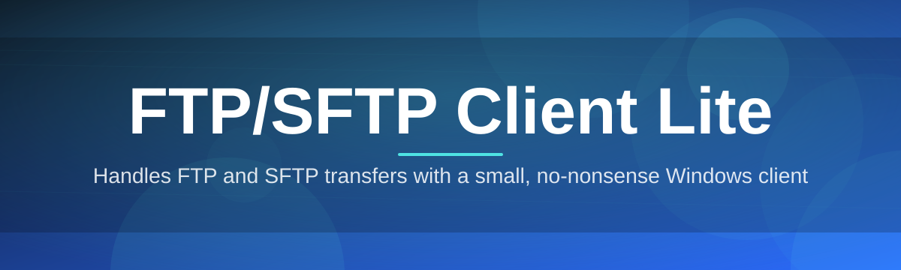

# ftp-sftp-client-manager 📁🔐

  

*A pocket-sized file bridge that turns clunky server transfers into a calm, drag-and-drop conversation.*

  

## 🌉 Overview

Every developer, sysadmin, and hobbyist webmaster eventually hits the same wall: you need to move files between your machine and a remote server, but the "serious" FTP/SFTP clients on the market feel like piloting a cargo ship just to deliver a postcard. Menus inside menus, license nags, and memory footprints that rival a small IDE — for a task that's fundamentally simple. **FTP/SFTP Client Lite** exists to shrink that gap. It's a standalone Windows utility that treats file transfer as a first-class, friction-free experience: point it at a host, authenticate, and drag.

Under the hood it speaks both classic **FTP** and encrypted **SFTP** (SSH File Transfer Protocol), so whether you're pushing static assets to a shared host or securely syncing config files to a hardened Linux box, the same interface handles it. We built this for the people who live in the terminal but don't *want* to — freelance developers juggling five client servers, students learning how deployment actually works, and IT folks who need a tool they can hand to a non-technical colleague without a training session.

What makes this project different isn't a giant feature checklist — it's restraint. No telemetry dashboards, no forced cloud account, no bundled toolbars. Just a fast, dependable client that respects your bandwidth, your time, and your Windows taskbar space.

> [!NOTE]
> "Lite" is a design philosophy here, not a missing-features apology. Every screen was trimmed until only the transfer mattered.

---

## ⚡ What's Inside the Toolbox

  

- **Dual-protocol brain** — Switch between FTP, FTPS, and SFTP from the same connection dialog; the client auto-negotiates the handshake so you don't have to remember port quirks.

- **Split-pane transfer canvas** — Local and remote directories sit side by side, and dragging a file between them feels like sliding a card across a table, not filling out a form.

- **Session vault** — Saved server profiles are encrypted locally, so reconnecting to your production box is a double-click, not a re-typed password ritual.

- **Resume-aware queueing** — Interrupted uploads and downloads pick up where they left off instead of restarting from byte zero, which matters a lot on shaky hotel Wi-Fi.

- **Bandwidth throttle dial** — Cap transfer speed on the fly so a bulk sync doesn't strangle your video call.

- **Live transfer log** — A scrolling, timestamped ledger of every command sent and response received, invaluable when a transfer silently fails and you need the *why*.

- **Directory bookmarking** — Pin frequently visited remote paths so you're never five folders deep before you find `/var/www/html` again.

- **Multi-tab sessions** — Juggle a staging server and a production server in separate tabs without losing your place in either.

> [!TIP]
> Rename a bookmark to something human ("Client Staging") instead of the raw path — future-you will thank present-you during a 2am deploy.

---

## 🚀 Up and Running

Getting this running takes less time than reading this section.

1. **Visit the landing page** using the download button above or below — that's the only official source for the installer.

2. **Grab the Windows package** and let it land in your Downloads folder; there's nothing to compile and no package manager involved.

3. **Run the executable** — FTP/SFTP Client Lite is a standalone build, so it launches directly without a lengthy setup wizard.

4. **Add your first server profile**, hit connect, and start dragging files between panes.

<strong>Prefer a portable, no-trace setup?</strong>

 

The app writes its settings and encrypted session vault to a local config folder next to the executable when run in portable mode. Drop it on a USB stick, and your bookmarks and profiles travel with you — nothing touches the Windows registry.

---

## 🖥️ System Requirements

| Requirement | Details |
|---|---|
| **OS** | Windows 10 (64-bit) or Windows 11 |
| **Dependencies** | None — fully standalone, no runtime installs required |
| **Disk space** | Under 50 MB installed |
| **Memory** | Comfortably runs in under 100 MB RAM during active transfers |
| **Network** | Outbound access on standard FTP (21), SFTP/SSH (22), or custom configured ports |
| **Admin rights** | Not required for normal use |

> [!IMPORTANT]
> Because it's self-contained, FTP/SFTP Client Lite does not require .NET, Java, or any third-party runtime pre-installed on the host machine.

---

## 🧭 How It Works

The internal flow is intentionally linear — there's no hidden background syncing or mystery caching layer:

1. You supply host, port, protocol, and credentials.
2. The client opens a control channel and, for SFTP, negotiates the SSH handshake.
3. Directory listings are fetched and rendered in the remote pane.
4. Drag-and-drop actions queue transfer jobs, which run through the resume-aware engine.
5. Completed jobs are logged, and the vault optionally saves the profile for next time.

> [!NOTE]
> SFTP sessions ride entirely over SSH, meaning file listings, transfers, and authentication are all encrypted in one tunnel — unlike plain FTP, which sends credentials in the clear unless wrapped in FTPS.

---

## 🩹 Troubleshooting

<strong>Why does my connection hang at "Authenticating"?</strong>

 

This usually means the server is waiting on a key exchange method the client hasn't tried yet, or a firewall is silently dropping packets after the initial handshake. Double-check the port and try toggling between SFTP and FTPS if you're unsure which the host expects.

<strong>My transfer says "Resumed" but restarted from zero anyway.</strong>

 

Some servers don't report accurate partial-file sizes, which breaks resume detection. Try disabling resume for that specific profile in its advanced settings.

<strong>Can I connect to a server with a self-signed certificate?</strong>

 

Yes — for FTPS and SFTP with unrecognized host keys, the client will prompt you to trust the fingerprint on first connect. Verify it against your server admin before accepting on unfamiliar networks.

<strong>Uploads are painfully slow on my connection.</strong>

 

Check the bandwidth throttle dial — it may have been set intentionally in a previous session. Also try switching passive vs active mode for plain FTP, since some routers mishandle one or the other.

<strong>The remote pane shows an empty folder that I know has files.</strong>

 

This is almost always a permissions issue on the server side, or a symlink the account isn't allowed to traverse. Try listing the same path via a terminal session to confirm.

---

## 🎨 UI / UX Details

> [!TIP]
> Everything below is remappable from **Settings → Shortcuts**, so treat these as defaults, not commandments.

| Action | Shortcut |
|---|---|
| New connection | `Ctrl + N` |
| Disconnect session | `Ctrl + D` |
| Refresh directory | `F5` |
| Queue transfer | `Enter` (on selected file) |
| Toggle transfer log | `Ctrl + L` |
| Switch tabs | `Ctrl + Tab` |

**Themes** — Light, Dark, and an auto mode that follows your Windows accent color, so the client blends into your desktop instead of fighting it.

**Settings that matter most:**

- Default transfer mode (binary/ASCII)
- Connection timeout thresholds
- Vault encryption passphrase
- Log retention window

---

## 🤝 Contributing & Community

This project grows because people who actually push files for a living tell us what's missing. Bug reports, protocol edge cases, and UI nitpicks are all welcome contributions — you don't need to write code to help.

- Open an issue describing the server type and protocol version if you hit a connection quirk.
- Pull requests for translations, documentation clarity, or bug fixes are reviewed regularly.
- Discussions are the right place for "how do I configure X server" style questions.

> [!WARNING]
> Never paste real credentials, private keys, or server hostnames into a public issue or discussion — sanitize logs before sharing.

---

## 📜 License

Released under the [MIT License](LICENSE), 2026. Use it, modify it, ship it inside your own workflow — just keep the license notice intact.

---

## ⚠️ Disclaimer

FTP/SFTP Client Lite is provided as-is, without warranty of any kind. Always verify server fingerprints on unfamiliar networks, back up critical data before bulk transfers, and use encrypted protocols (SFTP/FTPS) whenever handling sensitive files. The maintainers are not responsible for data loss resulting from misconfigured servers, unstable networks, or third-party host issues.

